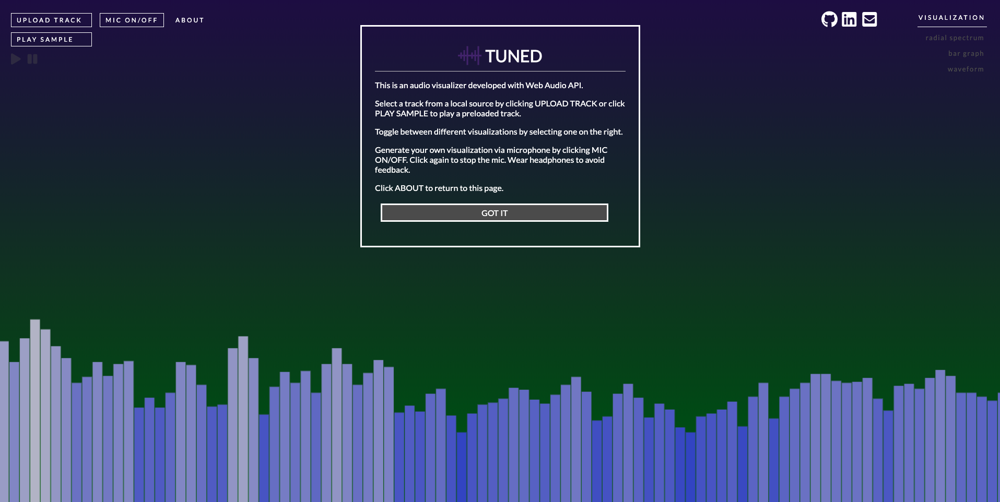

# [TUNED](https://1onyng.github.io/Tuned/)

## Technologies
 
* Javascript
* HTML Canvas
* CSS
* Web Audio API

## Summary

Tuned allows users to see what sound looks like by generating animations for the different ranges of frequencies from either a specific song or microphone input. Users have the ability to:

** Play their own song from a local source
** Play a sample track
** View frequency spectrum visualization for a specific song
** Generate their own waveforms via microphone
** Toggle between different animations



## Visualizations 

Each visualization has its own set of canvas drawings. The radial spectrum visual was the most complicated to draw becausae it required trigonometry to convert to Cartesian coordinates. The most critical part of this project was connecting the audio source to Web Audio API via the AnalyzerNode to eventually capture frequency data used for an animation. The setupAudio function takes care of the connection. The last step was to grab the data, store it an array, and iterate through it to define the shape and color of our visuals:    

```javascript
  function drawBarGraph(ctx, freqArray, bufferLength, analyser, width, height) {
    let barWidth = (width / bufferLength) * 2.5;
    let barHeight;
    let x = 0;

    analyser.getByteFrequencyData(freqArray);

    ctx.fillRect(0, 0, width, height);

    for (let i = 0; i < bufferLength; i++) {
      barHeight = freqArray[i] * 1.5;

      ctx.fillStyle = "rgb(" + freqArray[i] + ", " + freqArray[i] + ", " + 205 + ")";
      ctx.fillRect(x, height - barHeight, barWidth, barHeight);

      x += barWidth + 1;
    }
  }
  ```

## Adding the Microphone

Microphone support was included to enhance user experience. Connecting the microphone was a similar process to connecting a song, involving a few other methods that were specific to media devices.  

```javascript
  micInput.addEventListener('click', function () {
    navigator.getUserMedia = navigator.getUserMedia || navigator.webkitGetUserMedia;
    navigator.getUserMedia({ audio: true }, setupStream, error)
  });
```

```javascript
  function setupStream(stream) {
    audioCtx = new AudioContext();
    analyser = audioCtx.createAnalyser();
    analyser.smoothingTimeConstant = 0.2;
    analyser.fftSize = 1024;
    node = audioCtx.createScriptProcessor(1024, 1, 1);
    source = audioCtx.createMediaStreamSource(stream);
    source.connect(analyser);
    analyser.connect(node);
    analyser.connect(audioCtx.destination);
    animate();
  }
  ```

## Future Implementations

* Allow user to turn mic off
* Add playlist feature
* Provide more visualizations
* Allow user to manipulate / warp animation in real-time


